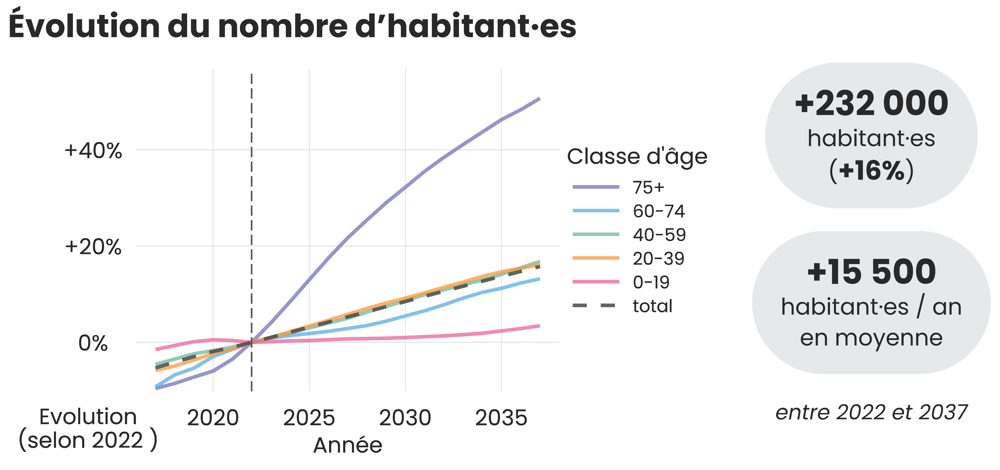

Ici se trouve une sélection de mes projets réalisés sur R en tant que développeuse chez ThinkR et analyste au département de Loire-Atlantique.

## Conversion d'un modèle de projections démographiques

Chaque année les données du recensement de la population sont publiées par l'INSEE et utilisée par le département de Loire-Atlantique pour projeter les évolutions démographiques à différentes échelles.

Pour ce projet, j'ai converti un modèle de projection existant (VBA) en un package R, accompagné d'une couverture de test unitaire complète et d'une documentation technique (`pkgdown`) mises à jour automatiquement via GitLab CI/CD.

Dans un second temps, j'ai ajouté au package la possibilité de générer automatiquement l'ensemble des 28 fiches de projections en respectant la charte graphique du département.

{#fig-dep width=70%}

**Résultat :** Le temps total de mise à jour annuelle des fiches de projections est passé de plusieurs jours à 4 minutes. Le risque d'erreur a été minimisé par la suppression de toutes les étapes manuelles.

<i class="bi bi-link-45deg pink"></i> [Lien fiches projections](https://observatoire.loire-atlantique.fr/44/les-statistiques/fiches-projections-demographiques-2022-2037/p1_12983)

## Mise en package d'un modèle de distribution d'espèces

Dans le cadre d'une étude statistique sur l'estimation de stock de poissons, j'ai mis en package un outil permettant d'harmoniser les données de capture hétérogènes.

La mise en package a été réalisée selon la méthode du _golden master_, où l'on s'assure que chaque modification apportée ne modifie pas le résultat statistique attendu sur un jeu de données test.

La mise en package s'est accompagnée de la rédaction d'une documentation technique et d'un _refactoring_ des paramètres d'entrée des fonctions.

{#fig-fishmap width=70%}

**Résultat :** Le package {fishmap} est disponible en open-source. Il est testé, documenté, et s'accompagne d'un manuel d'utilisation et d'un jeu de données test pour une prise en main rapide.

<i class="bi bi-link-45deg pink"></i> [Lien GitHub](https://github.com/balglave/FishMap)

## Refonte d'une application Shiny pour le suivi d'étude sensorimétrique

Ce projet a pour objectif d'améliorer une application Shiny évaluant la performance sensorimétrique de panels. Ce travail a consisté à _refactoriser_ le code existant et fluidifier l'interface utilisateur.

L'application se base sur un requêtage SQL de la base de données pour proposer à l'utilisateur un choix de produit à sélectionner. Une ANOVA est ensuite réalisée pour chaque critère de notation et retransmise sous forme de rapport téléchargeable.

Ce rapport contient les résultats sous forme de graphiques et de tableaux (ACP, boxplot, heatmap), résumant la capacité du panel à discriminer les produits par critère.

**Résultat :** L'utilisation de la nouvelle version de l'application a nettement réduit le temps dédié à la construction du rapport statistique, l'expérience utilisateur est fluidifiée tout en enrichissant le contenu graphique de l'application.

{#fig-shiny width=70%}

## Développement d'un package de présentation quarto

En tant que formatrice R, il m'a été nécessaire de développer du contenu pédagogique pour mes formations. Le format _quarto_ permet de créer des présentations _html_, mais uniquement à partir d'un seul fichier source.

Comme les cours sont rédigés chapitre par chapitre, j'ai développé le package [{squash}](https://github.com/ThinkR-open/squash), permettant de générer une présentation à partir de plusieurs fichiers _quarto_ source.

J'ai rédigé sa documentation dans le but qu'il soit accessible à tout utilisateur de R. Pour les développeurs avancés, il est possible de personnaliser le résultat via l'ajout d'extensions et de paramètres d'entrée optionnels.

{#fig-squash width=90%}

**Résultat :** Le package {squash} est disponible en open-source. Il est testé, documenté et déployé en continu sur GitHub. Il est utilisé en routine chez ThinkR pour ses formations R.

<i class="bi bi-link-45deg pink"></i> [Lien documentation](https://thinkr-open.github.io/squash/)
