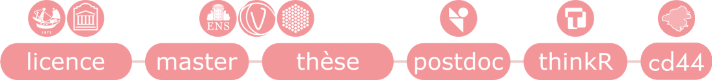

Vous êtes sur la page d'accueil de mon site personnel. Ici, vous trouverez des informations sur mon parcours et mes projets.

### Qui suis-je

Je m'appelle Swann, je suis bio-informaticienne de formation et je m'intéresse aux domaines des statistiques, de la biologie et de l'informatique. J'ai un parcours académique, avec un doctorat et un postdoctorat en bio-informatique (voir [mes projets de recherches](recherche.qmd)).

J'ai également travaillé comme consultante et formatrice R chez ThinkR, où j'ai affiné ma connaissance de R et mes pratiques de développement (voir [mes projets R](dev.qmd)). Je suis actuellement chargée d'analyse statistique au département de Loire-Atlantique.

{width=90% fig-align="center"}

### Mes outils

<i class="bi bi-terminal-fill pink"></i> R, Python, Bash, SQL

<i class="bi bi-gear-wide-connected pink"></i> Galaxy, Snakemake, Nextflow, gestionnaires d'environnement (docker, renv, uv) et de ressources (Slurm)

<i class="bi bi-github pink"></i> GitHub, GitLab, CI/CD

<i class="bi bi-file-earmark-code-fill pink"></i> Quarto, Shiny
