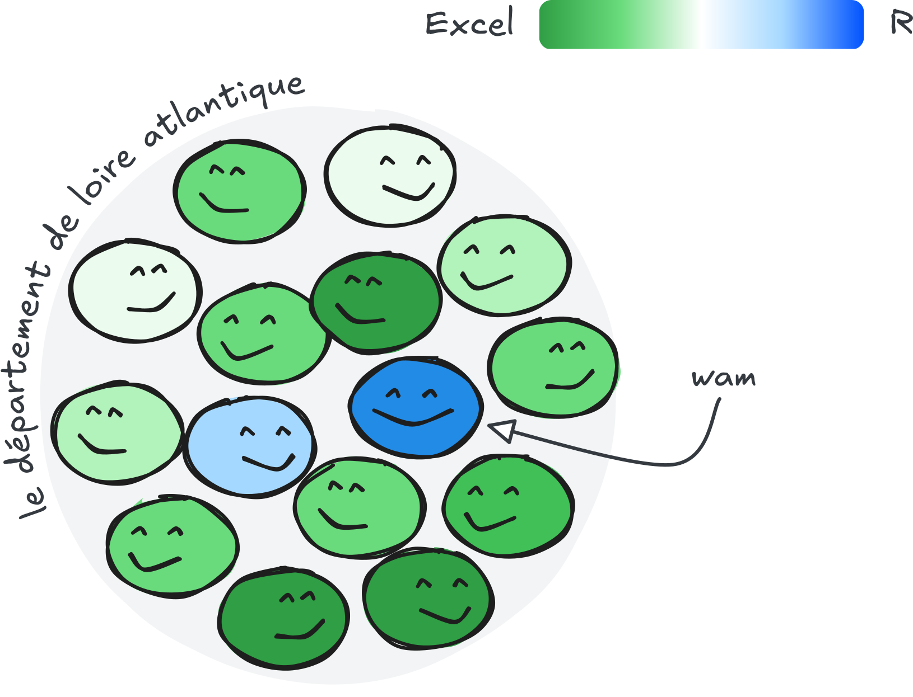
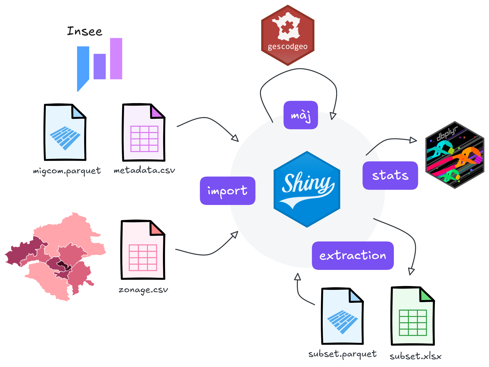
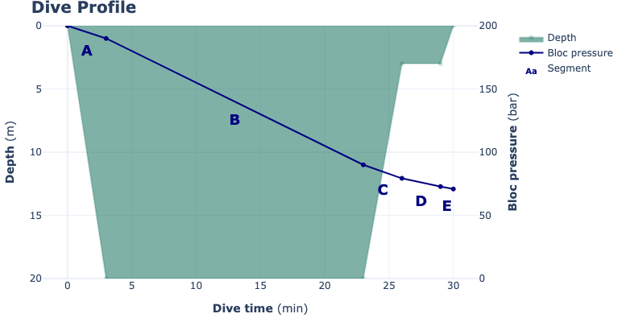
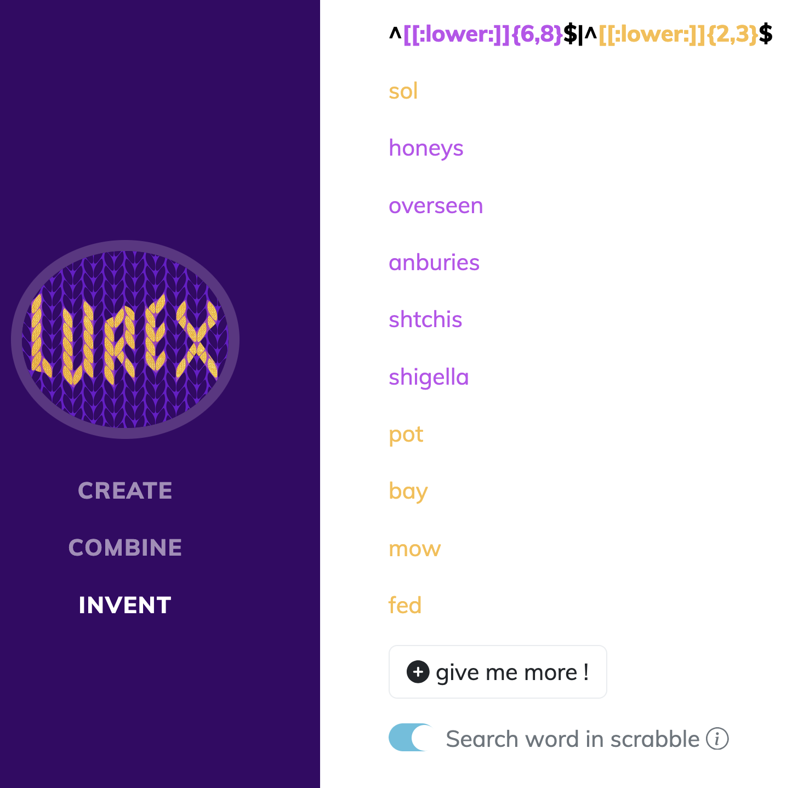

Ici, vous trouverez mes publications scientifiques, ainsi que des contenus de formation et des projets personnels.

## Publications scientifiques

::: {#refs}
:::

## Formation et vulgarisation

:::: {.columns style='display: flex'}

::: {.column style='display: flex; align-items: center;'}
{width="90%" fig-align="center"}
:::

::: {.column width=90%}
Les frictions de la cohabitation R-Excel

Présentation de l'application `{migres}` pour faciliter le traitement des jeux de données Insee volumineux.

<i class="bi bi-share-fill pink"></i> Présenté aux [Rencontres R 2025](https://rr2026.sciencesconf.org/712403)

<i class="bi bi-award-fill pink"></i> Prix de la meilleure présentation courte
:::

::::

:::: {.columns style='display: flex'}

::: {.column width=90%}
R avancé et introduction à Git

Contenu de la formation dispensée en 2026 aux étudiants du Master Économétrie appliquée de l'IAE Nantes, adapté de R. Nedellec.

<i class="bi bi-link-45deg pink"></i> Code sur [GitHub](https://github.com/dagousket/r-advanced-git)

<i class="bi bi-share-fill pink"></i> Site web déployée avec [GitHub Pages](https://dagousket.github.io/r-advanced-git/)
:::

::: {.column style='display: flex; align-items: center;'}
{width="90%" fig-align="center"}
:::

::::

:::: {.columns style='display: flex'}

::: {.column style='display: flex; align-items: center;'}
{width="70%" fig-align="center"}
:::

::: {.column width=90%}
Dompter son namespace avec un zeste de suggest

<i class="bi bi-link-45deg pink"></i> Article de blog sur [Rtask](https://rtask.thinkr.fr/fr/dompter-son-namespace-avec-un-zest-de-suggests/)

<i class="bi bi-share-fill pink"></i> Présenté aux [Rencontres R 2024](https://github.com/Rencontres-R/Rencontres_R_2024/blob/main/Pr%C3%A9sentations/01_Mercredi/04_Courte%201/02_Floc'hlay_Swann_Pour%20un%20namespace%20tout%20en%20souplesse.html)

<i class="bi bi-share-fill pink"></i> Mentionné dans le podcast [R weekly](https://share.fireside.fm/episode/87RSVeFz+2xVMmpYZ)
:::

::::

## Projets open-source

:::: {.columns style='display: flex'}

::: {.column style='display: flex; align-items: center;'}
{width="90%" fig-align="center"}
:::

::: {.column width=90%}
{millefeuille} : un package python pour les coordonnées génomiques

J'ai développé ce package pour faciliter la conversion de coordonnées génomiques lors de [ma thèse](recherche.qmd#analyse-de-déséquilibre-allélique). Initialement écrit en R, je l'ai plus récemment converti en python et ajouté une architecture de test unitaire complète.

<i class="bi bi-link-45deg pink"></i> Code sur [GitHub](https://github.com/dagousket/millefeuille)
:::

::::

:::: {.columns style='display: flex'}

::: {.column width=90%}
{migres} : une application pour faciliter l'analyse de jeux de données Insee

Cette application permet de manipuler les données à haute volumétrie de migrations résidentielles à partir d'un fichier parquet, et sans connaissances préalables de code.

<i class="bi bi-link-45deg pink"></i> Code sur [GitHub](https://github.com/dagousket/migres)

<i class="bi bi-share-fill pink"></i> Application déployée avec [ShinyApps](https://dagousket.shinyapps.io/migres/)
:::

::: {.column style='display: flex; align-items: center;'}
{width="90%" fig-align="center"}
:::

::::

:::: {.columns style='display: flex'}

::: {.column style='display: flex; align-items: center;'}
{width="90%" fig-align="center"}
:::

::: {.column width=90%}
{abloc} : une application Python + Shiny pour le calcul de consommation d'air

J'ai développé ce package pour mon activité d'encadrante de plongée sous-marine en club. Cette application permet d'illustrer la relation entre la quantité d'air consommé et la profondeur d'évolution du plongeur.

<i class="bi bi-link-45deg pink"></i> Code sur [GitHub](https://github.com/dagousket/abloc)

<i class="bi bi-share-fill pink"></i> Application déployée avec [ShinyApps](https://dagousket.shinyapps.io/abloc/)
:::

::::

:::: {.columns style='display: flex'}

::: {.column width=90%}
{lurex} : une application R + Shiny pour les regex

Cette application permet de construire une regex depuis un module de sélection interactive. J'ai développé cette application comme une première approche ludique des expressions régulières. Je l'ai utilisé comme support pour tester le déploiement en Wasm.

<i class="bi bi-link-45deg pink"></i> Code sur [GitHub](https://github.com/dagousket/lurex)

<i class="bi bi-share-fill pink"></i> Application déployée avec [WebR et ShinyLive](https://dagousket.github.io/lurex/)
:::

::: {.column style='display: flex; align-items: center;'}
{width="90%" fig-align="center"}
:::

::::
